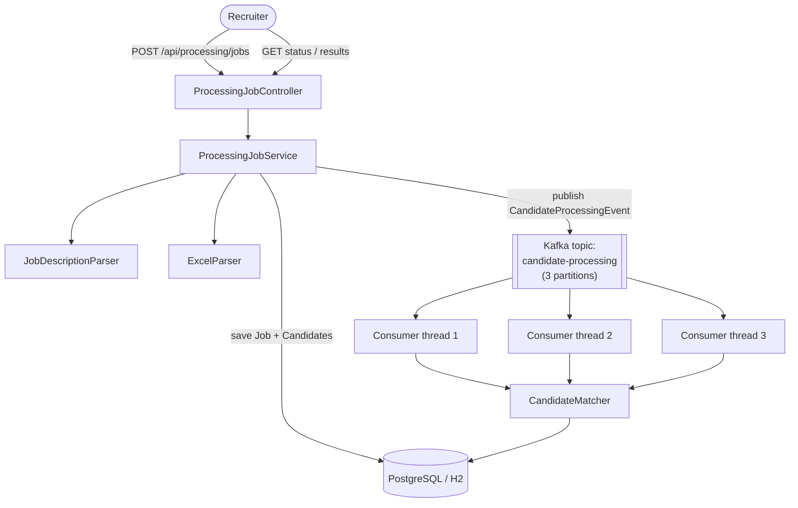
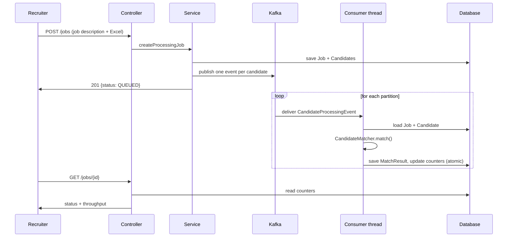

# Recruitment Processing Platform (V1)

A backend that takes a job description and a spreadsheet of candidates, and produces a ranked match score per candidate — built to learn how to design an **asynchronous, Kafka-driven bulk-processing system**, not just another CRUD app. The core learning goal: distributing candidate-scoring work across parallel Kafka consumers, with the correctness issues (races, idempotency, failure handling) that come with real concurrency, solved for real rather than glossed over.

## 1. Architecture



Two request-handling paths exist, on purpose:

- **`POST /api/processing/jobs`** — the real, production path. Parses and persists synchronously, then hands every candidate to Kafka and returns immediately (`QUEUED`). Three consumer threads (matching the topic's 3 partitions) score candidates in parallel in the background.
- **`POST /api/processing/jobs/sync`** — a second, deliberately-kept path that does everything synchronously, no Kafka involved, returning `COMPLETED` immediately. It exists purely so the two approaches can be measured against each other on identical data (see [Benchmarks](#8-benchmarks) below) — it is not how the app is meant to be used in practice.

**Dependency direction**: `controller → service → {parser, matching, repository, kafka}`. The `matching` package (the actual scoring algorithm) never imports Kafka, JPA, Apache POI, or Spring MVC — it depends on nothing outside plain Java and its own small value types (`CandidateProfile`, `matching.MatchResult`). `CandidateProcessingConsumer` (the async path) and `ProcessingJobService` (the sync path) each call `CandidateMatcher` independently; neither knows the other exists. That's what makes it possible to add a smarter matcher later (weighted scoring, semantic matching) by writing one new class, with zero changes to Kafka, the controller, or persistence.

## 2. Technology stack

| Technology | Why |
|---|---|
| Spring Boot 4.1.1 / Java 17 | Web framework, dependency injection, autoconfiguration |
| Spring Data JPA + Hibernate | Persistence, via the same `DataSource` abstraction regardless of which database is active |
| PostgreSQL / H2 | H2 (in-memory) is the default for zero-setup local dev; Postgres is a one-property-change away for anything closer to production |
| Apache Kafka (via `spring-boot-starter-kafka`) | Durable, parallel work distribution for candidate scoring |
| Apache POI | Reads the uploaded `.xlsx` candidate spreadsheet |
| Lombok | Cuts entity/DTO boilerplate (getters/setters/builders) |

## 3. Running it locally

### 3.1 Database

Nothing to do by default — the `local` Spring profile uses an in-memory H2 database, recreated on every restart.

To use real PostgreSQL instead:
```bash
docker compose up -d postgres
mvn spring-boot:run -Dspring-boot.run.arguments=--spring.profiles.active=postgres
```
No Java code changes either way — entities and repositories only ever talk to Spring's `DataSource` abstraction.

### 3.2 Kafka

Only needed if you want the async pipeline to actually complete (without it, jobs will sit at `QUEUED` forever, since nothing consumes the messages):
```bash
docker compose up -d kafka
```
This starts a single-broker, KRaft-mode Kafka (no separate ZooKeeper) on `localhost:9092`, matching `application.properties`.

### 3.3 The app

```bash
mvn spring-boot:run
```
Starts on port 8080. Watch for `Started RecruitmentProcessingPlatformApplication` in the logs.

## 4. Input formats

### Job description (plain text)

```text
Java Backend Developer

Skills:
Java, Spring Boot, SQL, Kafka, Docker

Experience:
0-2
```
Deterministic, label-based parsing — the first non-blank line is the title, and each `Skills:`/`Experience:` label is followed by the line holding its value. Not NLP.

### Candidate spreadsheet (`.xlsx`)

| candidate_id | name | email | skills | experience |
|---|---|---|---|---|
| C001 | Rahul | rahul@email.com | Java, Spring Boot, SQL | 1 |

`skills` is comma-separated. Row 1 is the header; invalid rows (missing fields, malformed email, non-numeric experience) are rejected individually and reported as failures — they never abort the whole upload.

## 5. API

| Method | Path | Description |
|---|---|---|
| `POST` | `/api/processing/jobs` | Create a job; processes candidates asynchronously via Kafka. Multipart: `jobDescription` (text), `candidates` (file). |
| `POST` | `/api/processing/jobs/sync` | Same request shape, but processes synchronously (no Kafka) — for comparison only. |
| `GET` | `/api/processing/jobs/{jobId}` | Status: counts, `processingDurationMillis`, `recordsPerSecond`. |
| `GET` | `/api/processing/jobs/{jobId}/results` | Candidates ranked by `finalScore` descending. |

Error responses are a uniform `{"message": "..."}` body with an appropriate 4xx status (400 for malformed input, 404 for an unknown job id).

## 6. Kafka architecture

- **Topic**: `candidate-processing`, 3 partitions, declared explicitly via a `NewTopic` bean (not auto-creation).
- **Message**: `{processingJobId, candidateId}` — two UUIDs, not the full candidate record. Keeps messages small regardless of how large a candidate's data gets, and means schema changes to `Candidate` never touch the wire format.
- **Partition key**: `candidateId`, not `processingJobId` — spreads one job's candidates across all partitions so multiple consumers can work on the *same* job in parallel. Keying by job id would serialize an entire job onto a single partition.
- **Consumer group**: `candidate-processing-group`, concurrency configurable via `recruitment.kafka.consumer-concurrency` (default 3, matching the partition count — more threads than partitions just sit idle).
- **Delivery semantics**: at-least-once. A crash between finishing work and committing an offset causes redelivery; the consumer is idempotent (an `exists` pre-check plus a DB unique constraint as the hard guarantee) so a redelivered message never double-counts.
- **Producer/consumer ordering**: the actual Kafka `send()` is deferred until *after* the producing transaction commits (`TransactionSynchronizationManager.afterCommit`) — publishing inside an open transaction let a fast consumer see a message before the row it referenced was durably visible, a real bug caught by testing at 1,000 candidates.

## 7. Processing flow



Job status moves `QUEUED → PROCESSING → COMPLETED` as consumers work through the candidates; `processedCandidates` is an atomic database counter (not an application-held value), which is what makes it safe under concurrent consumer threads.

## 8. Benchmarks

Real measured numbers (this machine; run `mvn test -DexcludedGroups= -Dgroups=benchmark` yourself to reproduce):

**Scale** (async, default concurrency = 3):

| Candidates | Wall-clock | Records/sec | Matched |
|---|---|---|---|
| 1,000 | 3,028 ms | 403.1 | 500 |
| 10,000 | 6,424 ms | 1,778.1 | 5,000 |
| 50,000 | 14,145 ms | 4,172.6 | 25,000 |
| 100,000 | 23,620 ms | 5,128.5 | 50,000 |

Throughput climbs with scale mostly because fixed startup cost (Spring context, embedded broker, JIT warmup) is a shrinking fraction of the total as the workload grows — not because per-candidate work gets cheaper.

**Consumer concurrency** (20,000 candidates, identical workload):

| Concurrency | Wall-clock | Records/sec |
|---|---|---|
| 1 thread | 16,671 ms | 1,336.6 |
| 3 threads | 13,223 ms | 1,748.4 |

~1.3x from 3x the threads, not 3x — the real bottleneck is database round-trips per candidate (up to 7-8 in the async path vs. 2 in the synchronous one), which don't parallelize across threads sharing one database.

**Synchronous vs. asynchronous, same 10,000 candidates**: synchronous finished in **2,801 ms**, async in **9,577 ms** — synchronous was faster, because with today's near-instant matching algorithm, the bottleneck is database overhead, and async simply has more of it. Artificially slowing matching to 10ms/candidate (simulating a genuinely expensive scoring algorithm — an ML call, an external lookup) flips this: synchronous took 47,982 ms, async took 20,243 ms — **async 2.37x faster**, because now the parallelizable work (matching) dominates over the fixed per-candidate overhead. Kafka's real value here isn't raw single-batch speed on one machine — it's not blocking the HTTP response, surviving a crash mid-batch, and scaling across more machines, none of which a synchronous loop can do at all.

Run all of the above yourself:
```bash
mvn test -DexcludedGroups= -Dgroups=benchmark
```

## 9. Future improvements (V2+)

- **V2**: weighted skill scoring (some skills matter more than others)
- **V3-V4**: resume PDF/DOCX parsing, richer candidate profile extraction
- **V5**: semantic/AI-based matching
- **V6**: Redis caching
- **V7**: Kafka retries + a Dead Letter Topic (today's failure handling deliberately stops short of this — see `CandidateProcessingConsumer`)
- **V8**: Elasticsearch-backed candidate search
- **V9-V10**: containerized deployment, Prometheus/Grafana metrics
- **V11-V12**: horizontal worker scaling, benchmarks at 500k-1M candidates
